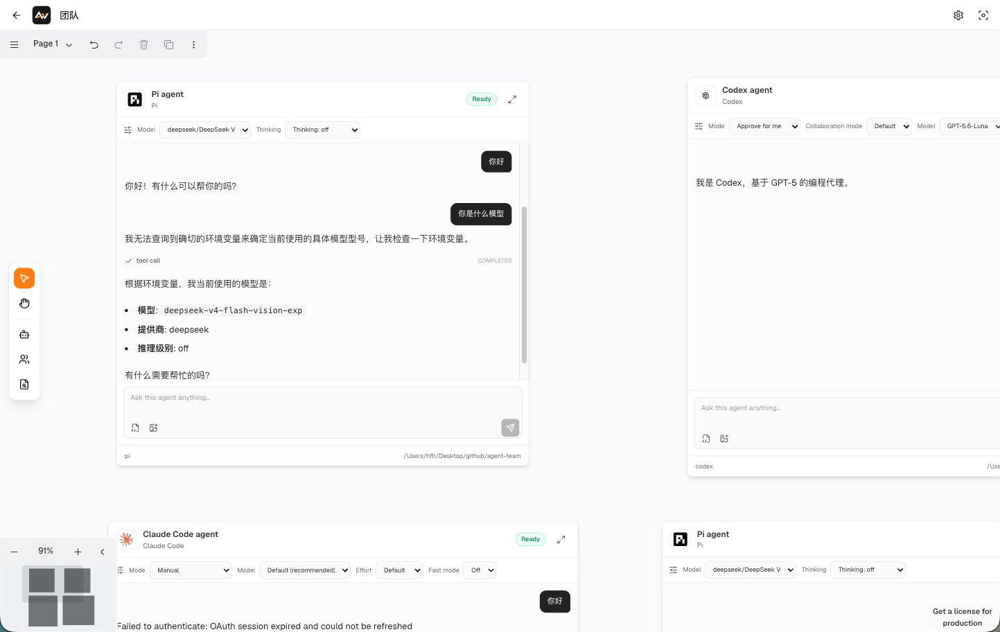
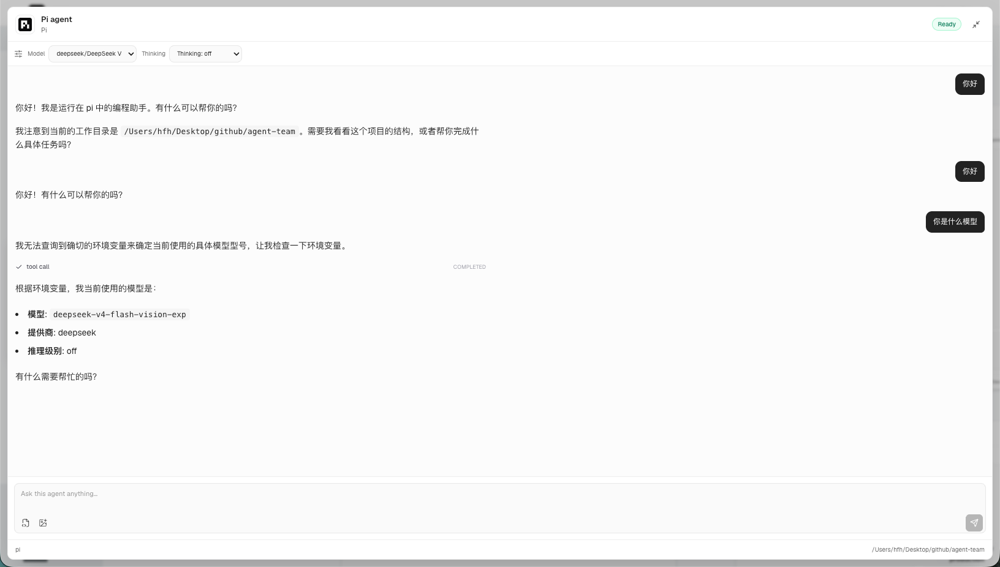
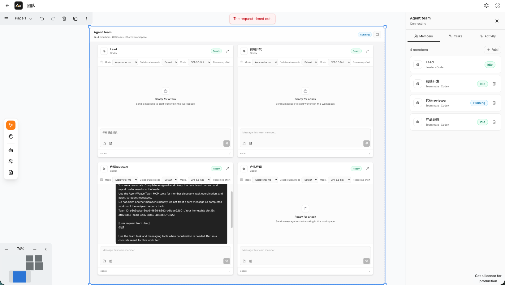
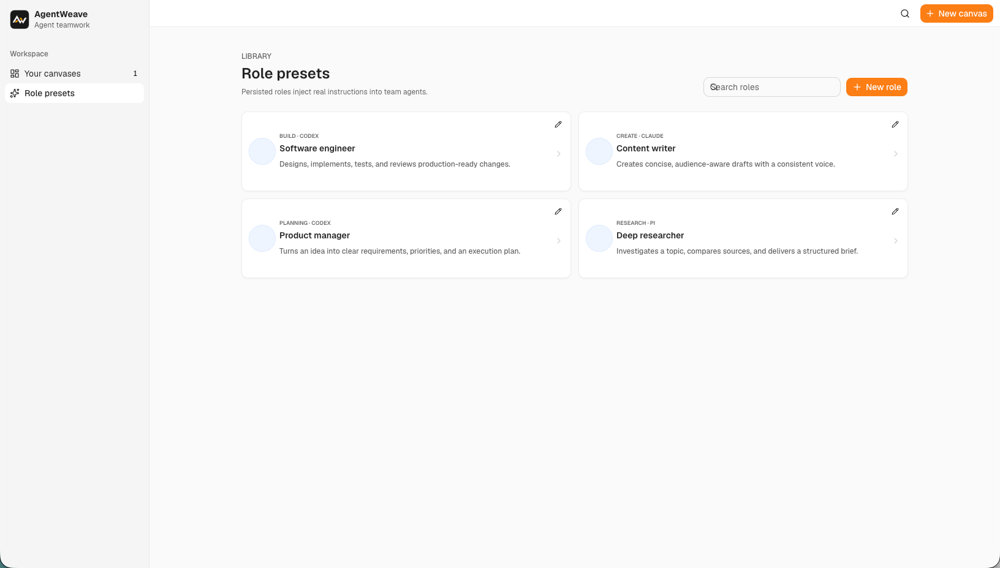

# AgentWeave

[English](README.md) | [简体中文](README.zh-CN.md)

AgentWeave 是一个本地优先的空间化 AI Agent 工作台，用于运行独立 Agent 并协同多个 Agent Team。项目将可视化画布、持久化会话、角色预设、团队编排和 Electron 桌面端整合在一个 pnpm monorepo 中。

> AgentWeave 目前仍在持续开发，首个稳定版本发布前，API 和持久化数据格式可能发生变化。

## 产品预览

### 空间化多 Agent 画布

在同一张无限画布中放置来自不同 Provider 的 Agent，保持会话相互独立，并围绕任务自由组织工作空间。



### 实时 Agent 会话

直接在可缩放的画布节点中与 Agent 协作，并使用模型控制、流式回复、思考过程、工具调用和工作区上下文。



### Agent Team 编排

在一个 Team 节点中协调 Leader 和多个成员，同时通过团队面板查看成员、任务和活动状态。



### 可复用角色预设

创建带有 Provider 和专属指令的持久化角色，在组建新的 Agent Team 时保持角色能力一致。



## 核心能力

- **空间化画布**：在持久化的 tldraw 画布上组织 Agent、Agent Team、文件和工作上下文。
- **实时 Agent 会话**：通过 SSE 流式接收回复、思考过程、工具调用、权限请求和用量更新。
- **持久化 Session**：使用 SQLite 保存会话、完整内容块、运行记录、画布快照和团队状态。
- **共享记忆基础**：从已完成的 Agent 工作中沉淀可复用知识，并在不同会话和 Agent 之间召回，让团队能够复用既有决策、发现和工作方法。
- **Agent Team**：创建 Leader 和多个成员；每个成员拥有隔离会话，并可共享工作区上下文、任务和邮箱消息；新增成员需要显式审批。
- **角色预设**：保存可复用的角色、Agent Provider 和 System Prompt，并分配给团队 Leader 或成员。
- **本地文件访问**：通过受限的只读 API 浏览和预览 Agent 工作区中的受支持文件。
- **桌面应用**：将 Web UI 和内嵌 API 打包为 macOS 或 Windows 应用。

## 项目架构

| 包 | 职责 |
| --- | --- |
| `packages/web` | React 19 应用、tldraw 画布、会话界面和团队管理 |
| `packages/server` | Express API、SQLite 持久化、SSE、acpx 集成和团队编排 |
| `packages/contracts` | 共享 Zod Schema、请求/响应 DTO、事件和领域类型 |
| `packages/desktop` | Electron 外壳以及 macOS/Windows 打包配置 |

服务端通过 `acpx` 与 Agent Runtime 通信。Team Agent 还会通过带身份验证的 stdio MCP Bridge 进行协作。每个成员拥有独立的受管会话，Team Service 统一协调运行、任务、邮箱意图、新成员审批和可重放事件。

## 环境要求

- Node.js 24 或更高版本
- pnpm 11（仓库通过 `packageManager` 固定了期望版本）
- 本地 `acpx` 支持的 Agent Provider

## 快速开始

安装依赖并同时启动 Web 应用和 API：

```bash
pnpm install
pnpm dev
```

Web 应用默认访问地址为 `http://localhost:5173`。

也可以分别启动前端或服务端：

```bash
pnpm dev:web
pnpm dev:server
```

启动 Electron 桌面应用，同时启动开发用 Web 和 API 服务：

```bash
pnpm dev:desktop
```

## 配置

需要覆盖默认服务端配置时，先复制环境变量示例：

```bash
cp packages/server/.env.example packages/server/.env
```

服务端配置包括监听地址、端口、CORS 来源、SQLite 数据库路径、acpx 状态目录和单次运行超时时间。桌面生产包默认将状态写入对应平台的用户数据目录。启动桌面应用前设置 `AGENT_WEAVE_API_ORIGIN`，可以连接外部 API 服务。

## 桌面端打包

生成未封装的应用目录：

```bash
pnpm desktop:pack
```

在 `packages/desktop/release` 下生成可分发安装包：

```bash
pnpm desktop:dist:mac
pnpm desktop:dist:win
```

macOS 构建会生成适用于 Intel 和 Apple Silicon 的 DMG 与 ZIP；Windows 构建会生成 x64 NSIS 安装程序和便携版 EXE。

## 主要 API

API 统一挂载在 `/api/v1` 下，主要包括：

- `/canvases`：画布元数据和持久化快照
- `/conversations`：会话、运行、权限、配置和 SSE 事件
- `/teams`：团队成员、消息、运行、任务、审批和团队事件流
- `/role-presets`：可复用的 Agent 角色和 System Prompt
- `/files`：受限的只读目录、文本和图片访问

Conversation 和 Team 事件流支持通过 Sequence Cursor 断线重连。实时内容增量以临时 SSE 事件发送，完成后的 Run 内容则以完整内容块存储，从而减少刷新页面时的事件回放量。

## 未来规划

- **稳定 Web 版本**：完善画布持久化、Agent 与 Team 生命周期恢复、流式连接重连、错误处理、兼容性和端到端测试覆盖。
- **完善 Desktop 版本**：保持 macOS、Windows 与 Web 版本的功能一致，提升内嵌服务、环境检测、数据迁移、签名打包和自动更新的可靠性。
- **产物实时更新**：将 Agent 创建的文件和交付物实时同步到工作区，在内容变化时增量刷新预览，保留产物版本，并展示构建与导出状态，无需手动刷新。
- **多 Agent 复用记忆沉淀**：建立个人记忆、项目记忆和 Team 共享记忆分层，让一个 Agent 的有效发现可以被其他 Agent 直接召回，减少重复研究和重复配置。
- **国际化**：持续保持英文和简体中文一致，默认跟随系统语言并保留用户手动选择，同时在新增界面时同步补齐本地化覆盖。
- **Skills 功能**：支持可复用 Skill 的发现、安装、配置、权限控制，以及向独立 Agent、角色预设和 Agent Team 分配 Skill。
- **Office 功能**：通过 Agent 工作流创建、读取、编辑、预览和导出 Word 文档、电子表格、演示文稿与 PDF。

## 质量检查

在项目根目录执行全部检查：

```bash
pnpm typecheck
pnpm lint
pnpm test
pnpm build
```

## 相关文档

- [`docs/agent-team-product-interaction.md`](docs/agent-team-product-interaction.md)：Agent Team 产品交互流程
- [`docs/agent-team-code-architecture.md`](docs/agent-team-code-architecture.md)：Agent Team 代码架构和职责边界

## 交流群

欢迎扫码加入 AgentWeave 微信交流群，一起交流产品动态、使用体验和问题反馈。入群二维码会定期更新。


## 开源协议

项目目前尚未声明开源协议。在正式添加 License 前，仓库所有者保留全部权利。
